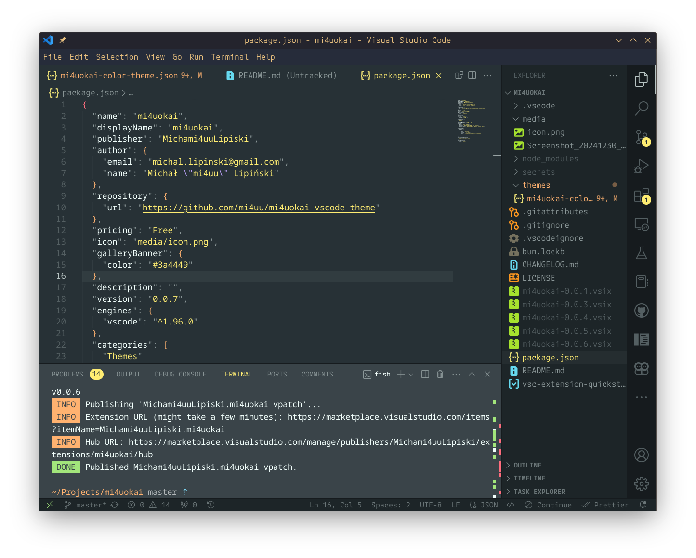

# mi4uokai README
monokai modified dark theme (but not very dark)
uses modified sharp icons 

#### base theme:


#### alt theme:


## install
```
ext install Michami4uuLipiski.mi4uokai
```
## marketplace 

##### vscode
[marketplace.visualstudio.com/items?itemName=Michami4uuLipiski.mi4uokai](marketplace.visualstudio.com/items?itemName=Michami4uuLipiski.mi4uokai)

##### open-vsx
[https://open-vsx.org/extension/Michami4uuLipiski/mi4uokai](https://open-vsx.org/extension/Michami4uuLipiski/mi4uokai)

## repo
[https://github.com/mi4uu/mi4uokai-vscode-theme](https://github.com/mi4uu/mi4uokai-vscode-theme)


## contributions
wont be possible without great  "Sharp Icons" project  [sharp-icons]( https://github.com/rylydou/sharp-icons)
